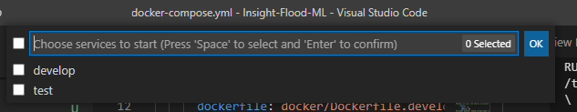

# Docker

Docker is an open platform for developing, shipping, and running applications. Docker provides the ability to package and run an application in a loosely isolated environment called a container. The Docker container allows for multiple users to consistently setup and execute script. The container isolation and security also allows for running multiple containers simultaneously on a given host (e.g., computer). Containers are lightweight and contain everything needed to run the application, so it does not rely on what is currently installed on the host. Docker containers are orchestrated localled with docker-compose.

Docker-compose is a tool for defining and running multi-container Docker applications. With Compose, you use a YAML file to configure your application’s services. Then, with a single command, you create and start all the services from your configuration.

# Getting Started

Before getting started, for windows install Docker desktop and the windows sublinux system version 2 (for Windows 10 only), and for linux, install docker and docker-compose; see the Appendix at the end of this document.


## Building the Container with Docker Compose

(If the Dockerfile has already been tested skip this step and proceed to Step 4)

Docker-compose orchestrates the creation of the Docker container from the Docker file. It also is a tool for defining and running multi-container Docker applications (simultaneously) that share the same network.  Docker compose executes instructutions found in the (docker-compose) YAML file that configures the container application’s services. A single command (on the command line or through bash) creates and starts all the services from your configuration.

### Yaml file Configuration

Before running the container, open the docker-compose.yml file and  examine if folder volumes on the container map to the correct local folders on one's computer.  Note under the 'volumes' section of the docker-compose file, the folder location on the local computer is given before the colon while the location in the container is given after the colon. Just change the location on the computer (text before the colon), as desired. Also note the port over which the Jupyter notebook is accessed (here it set as 8080). Change as necessary.

### Running Docker Compose

#### From VS Code

(Install the required Extensions; see the Appendix in the 'src' folder README file)

From VS Code, right click on the docker-compose.yml file, and select on 'Compose Up' (if building all services), or 'Compose Up - Select Services'. Then select the services to run from the top of the VS Code screen, e.g.,



Once the services are running, open any Jupyter notebook within the project, and select the icon 'Jupyter Server', i.e.,


Upon clicking the Jupyter Server icon, a prompt will appear at the top of VS Code for the address to the Jupyter Server, i.e.,


To connect to the running Docker container, select 'Existing' and then insert the web address to the Jupyter Server. For a locally run Docker image, the address will appear as circled, where the port (e.g., 8080) matches the port mapping from the docker-compose yaml file.

#### From the Command Line

To use docker-compose to run the container:

* Open the command line prompt or bash. When using bash, the docker-compose command may need to be prefaced by the `sudo`.
* Change directory to the project folder with the docker-compose.yml file.
* Run the command `docker-compose up --build my-service-name` to run the docker container.

The variable `my-service-name` is found in the docker compose file as the next level directly under `services`. If a service is not listed after the command `docker-compose up --build` then the docker-compose will buid all services at once.

##### Accessing the Container

Once docker-compose has completed the command line (or bash) will display a link with an access token for accesing the Jupyter notebook. Depending on the installations, other services (such as nteract <https://nteract.io/>) may be available. Generally, using a web browser, a notebook environment is acccessed via one of the following links

* Jupyter Lab -- <http://localhost:8889/lab>
* Jupyter Notebook -- <http://localhost:8889>

Note that the port (here given as 8080) depends on the settings in the dockerfile. If the connection through the web browser fails, please check the port setting in the docker-comopose.yml file. For more information on Nteract, please refer to <https://nteract.io/>. Nteract was developed by Netflix <https://netflixtechblog.com/notebook-innovation-591ee3221233>

##### Rebuilding Running Container

When updating a running Docker container with installations (e.g., GRASSS GIS) or pipe and conda packages:

* Stop running the docker container with control + c
* Execute the command 'docker-compose down' from the folder where the docker-compose file resides
* Edit the requirements in the requirements.txt file or Dockerfile
* Rebuild the container with docker-compose up

#### Project Specifics

This project consists of two services:

* test - for testing the build of the image that is pushed to the Containter registry via the pipeline.
* develop - for interating the batch processing code for creating machine learning features, which pull down the Docker image from the Container Registry.

Initially use the 'test' service to check the Dockerfile guild. Thereafter, use the 'develop' service to pull the stable image (with a few packages installations that aid development). Since the 'develop' service starts from an image in the  container registry, it requires that one login into the registry following the directions in the Appendix.


# Appendix

## Required Software

For a windows environment, Docker requires the following software:

* Docker desktop - <https://www.docker.com/products/docker-desktop>
* Windows sub-Linux SYstem - <https://docs.microsoft.com/en-us/windows/wsl/install-win10>

Note that this only requires completely steps up to and including Step 5. No need to install a Linux distribution.

## Jupyter Lab/Notebook Internet Connectivity

If connecting to the internet with Jupyter or equivalent to download information, one first has to execute the following lines of script

* import ssl
* ssl._create_default_https_context = ssl._create_unverified_context

<https://stackoverflow.com/questions/50236117/scraping-ssl-certificate-verify-failed-error-for-http-en-wikipedia-org>

## Issues/Problems with Solutions

### WSL2 Virtual Disk (ext4.vhdx) is too Large

Docker Desktop for Windows uses WSL to manage all your images and container files and keeps them in a private virtual hard drive (VHDX) called ext4.vhdx. It's usually in C:\Users\YOUR-USER-NAME\AppData\Local\Docker\wsl\data. A significant amount of storage may be relacimed (after pruning images, etc) with Optimize-Vhd under an administrator PowerShell shell/prompt. After changing directory to where the ext4.vhdx file is located run the following command in an administrator PowerShell prompt:

```

optimize-vhd -Path .\ext4.vhdx -Mode full
```

Occassionally, with the previous command, the following error will occur: 'Hyper-V encountered an error trying to access an object on computer ‘localhost’ because the object was not found. The object might have been deleted. Verify that the Virtual Machine Management service on the computer is running. If the service is running, try to perform the task again by using Run as Administrator.' In such a case, run the following code from an administrator command prompt or PowerShell:

```

MOFCOMP %SYSTEMROOT%\System32\WindowsVirtualization.V2.mof
```

This last command recompiles the Microsoft Object Format (MOF). Subsequently, run the command to optimize the size of the ext4.vhdx file.

### Docker-Compose resources (CPUs and Memory)

The execution of script often will fail when the resources allocated in docker-compose (under the resources header) are greater than the resources available on the computer on which Docker is running.