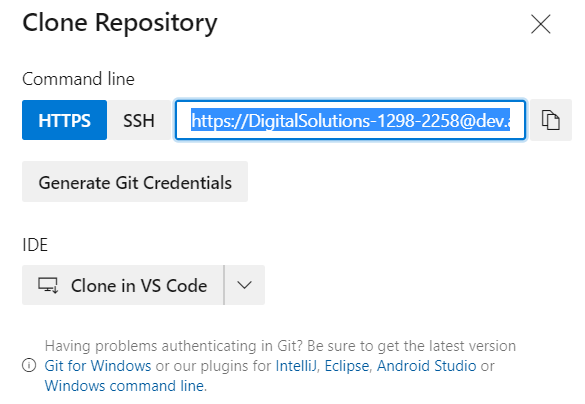
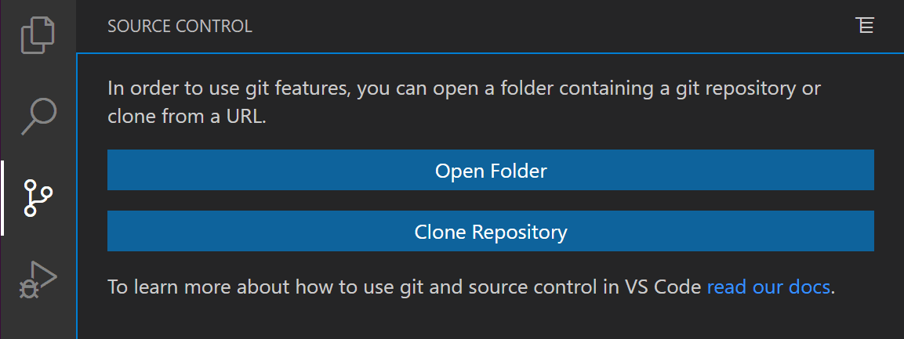

# Development (and Git) Best Practices

Development of the script may be done in Jupyter lab or in a Jupyter notebook run within VS Code. VS Code is a code editor that may be used with a variety of programming languages.

<https://code.visualstudio.com/>

For a list of the VS code extensions that should be intalled, please view the Appendix at the end of this document.

Typically, git and git for jupyter lab is already installed in the Docker environment. For local use, git bash (<https://git-scm.com/downloads>) and GitHub desktop (<https://desktop.github.com/>) may be used for syncing local files with the repository.

## Create Docker Container

Creat the docker container in which development code is executed. Refer to the instructions in the Docker folder directory. In most cases, skip to Step 4 of the instructions and use Docker-compose to create the Docker container. The container should have an internal folder mapped to a local folder on the development machine. In VS code, right clicking on the docker-compose file allows the running of docker-compose up to start the appropriate docker containers. Then connect to Jupyter kernel following the README file in the 'docker' folder of the project.

## DevOps Git Credentials

In some cases, the use of git requests credentials. These may be generated in Azure DevOps by clicking on the clone button and then clicking on generate git credentials:



## Git Workflow

The git worflow generally follows from this article:

<https://blog.scottlowe.org/2015/01/27/using-fork-branch-git-workflow/>

with the exception of the forking and setting an upstream remote (different from the origin remote) both of which are typically not applicable.

After installing git (see the Appendix), the initial setup involves:

- Clone the resposity to the local system.
- Add a Git remote for the original repository.

See the Appendix for more details on cloning and setting remotes. 

In the future, the ssl certificate should be installed to avoid setting ssl verify to false (which will be part of a future documentation effort).

One the local repository has been synced with remote archive of the repository, the base workflow with git is

- Create a feature branch in which to place your changes.
- Commit the changes to the branch.
  - In the summary commit message, follow the following format:
    - Feature-type:some-brief-description, where 'Feature-type' is one of the following:
      - Fix
      - Bug
      - Enhancement
      - Or other suitable descriptor.
- Push the branch to the git repo.
- Open a pull request from the new branch to the original repo.
  - Add a reviewer of the pull request. If unsure about the reviewer, talk to the group.
    - Reviews need not be exhaustive, but merely a sanity check for what was done and to adjust code for best practices.
- Clean up after the pull request is merged.
  - Pruning based on the origin may be helpful, i.e., `git config remote.origin.prune true`

## Git Ignore File - To Avoid Unncessary Tracking

If git is tracking too many tiles, the gitignore file needs to be alterned. Each project starts with a gitignore file. Generally, a gitignore file specifies intentionally untracked files that Git should ignore. Files already tracked by Git are not affected; see the NOTES below for details.

Each line in a gitignore file specifies a pattern. When deciding whether to ignore a path, Git normally checks gitignore patterns from multiple sources, with the following order of precedence, from highest to lowest (within one level of precedence, the last matching pattern decides the outcome. For more information refer to <https://git-scm.com/docs/gitignore>.

## Linting

When using VS Code, turn on linting by openning the Command Palette (Ctrl+Shift+P) and selecting 'Python:Select Linter'. Select a linter (pycodestyle). See <https://code.visualstudio.com/docs/python/linting>. In Jupyter Lab linting via pycodestyle is enabled (automatically) in JupyterLab with the 'develop' Docker environment. JupyterLab also has a code formatter (indicated by a hurricane symbol) in when viewing notebooks for formatting Python code following standard conventions.
# Appendix

## Initializing the Repository

One may use script or an interface (e.g., JupyterLab or VS Code) to initliaze the git repository. VS Code is the preferred tool for using git.


Alternatively, the git repository may be cloned through a graphical user interface such as the one in VS Code or JupyterLab. In VS code, the starting point is cloning a resposity or opening a folder, i.e.,


For more information on using git in VS Code, please refer to <https://code.visualstudio.com/docs/editor/versioncontrol>. When a repository is cloned, git will copy down the repository, both contents and commit history, to your system. Git will also add a Git remote called origin that points back to the repository.

 In the case of JupyterLab, after clicking on the git symbol on the left side toolbar, click on clone repository and paste in the address of the respository of interest.


For more information on using git in JupyterLab please refer to <https://github.com/jupyterlab/jupyterlab-git>.

When using git bash, the repository is initialized as

```git
git clone https://the-address-to-the-git-repo
```

## Setting the Remote

Git already added a Git remote named origin to the clone of the Git repository on your system, and this will allow you to push changes back up to the forked repository in your GitHub account using git commit (to add commits locally) and git push. I described this process in the previous article on using Git with GitHub.

Recall that the generic form of git push is this git push <remote> <branch>; this implies that there could be other Git remotes besides origin. That is definitely the case; as I mentioned in the previous article, you’ll need a Git remote for any repository to which you’d like push changes or from which you’d like to pull changes.

To use the “fork and branch” workflow, you’ll need to add a Git remote pointing back to the original repository (the one you forked on GitHub). You can call this Git remote anything you want; most documents and guides I’ve read recommend using the term “upstream”. Let’s say you forked the OVS web site repo, and then cloned it down to your system. You’d want to add a Git remote that points back to the original repository, like this:

git remote add upstream <https://github.com/openvswitch/openvswitch.github.io.git>

## VS Code Extensions

For using a VS Code, extenstions should be installed through the VS code application by clicking on the extension manager on the left side tool bar. If behind a corporate firewall (VPN) installations may result in an error; therefore, disconnect from the corporate VPN, as discussed in the next section. At a mininum, the following extensions should be installed:

- Python - An extension with rich support for the Python language (for all actively supported versions of the language: >=3.6), including features such as IntelliSense (Pylance), linting, debugging, code navigation, code formatting, refactoring, variable explorer, test explorer. <https://marketplace.visualstudio.com/items?itemName=ms-python.python>. By default this extension also installs
  - Pylance - An extension that works alongside Python in Visual Studio Code to provide performant language support. Under the hood, Pylance is powered by Pyright, Microsoft's static type checking tool. Using Pyright, Pylance has the ability to supercharge your Python IntelliSense experience with rich type information, helping you write better code faster.
  - Jupyter Extension - disussed below.
- Jupyter Extension - An extension that provides basic notebook support for language kernels that are supported in Jupyter Notebooks today.  <https://marketplace.visualstudio.com/items?itemName=ms-toolsai.jupyter>. Many language kernels will work with no modification. To enable advanced features, modifications may be needed in the VS Code language extensions.  By default, this extension also includes:
  - Jupyter Keymaps and
  - Jupyter Notebook Renderers.
    - The Jupyter Keymaps extension provides Jupyter-consistent keymaps and the Jupyter Notebook Rendereres extension provides renderers for mime types such as latex, plotly, vega and the like.
- Docker - Eases the build, management, and deployment of containerized applications from Visual Studio Code. <https://marketplace.visualstudio.com/items?itemName=ms-azuretools.vscode-docker>. It also provides one-click debugging of Node.js, Python, and .NET Core inside a container.
  - Requires the installation of Docker on your machine and with Docker adaded to the system path. On Linux, enable rootless Docker and set the generated Docker context to "rootless" (more secure) or enable Docker CLI for the non-root user account (less secure) that will be used to run VS Code.

- Remote Containers - An extension for using Docker container as a full-featured development environment. <https://marketplace.visualstudio.com/items?itemName=ms-vscode-remote.remote-containers>. The extension starts (or attaches to) a development container running a well defined tool and runtime stack. Workspace files can be mounted into the container from the local file system, or copied or cloned into it once the container is running. VS Code then works as if everything were running locally on your machine, except now they are separated inside a container. Extensions are installed and run inside the container where they have full access to the tools, platform, and file system.
 Whether you deploy to containers or not, containers make a great development environment because if enables
  - Development with a consistent, easily reproducible toolchain on the same operating system you deploy to.
  - Swapping between different, separate development environments and safely make updates without worrying about impacting your local machine.
  - Eases new team members / contributors to get up and running in a consistent development environment.
  - Allows for the testing of new technologies or clone a copy of a code base without impacting your local setup.

- YAML - Provides comprehensive YAML Language support to Visual Studio Code, via the yaml-language-server, with built-in Kubernetes syntax support. <https://marketplace.visualstudio.com/items?itemName=redhat.vscode-yaml>.
- markdownlint - The Markdown markup language is designed to be easy to read, write, and understand. It succeeds - and its flexibility is both a benefit and a drawback. Many styles are possible, so formatting can be inconsistent. Some constructs don't work well in all parsers and should be avoided. <https://marketplace.visualstudio.com/items?itemName=DavidAnson.vscode-markdownlint>.


The following plugins are not necessary, unless planning to work with Kubernetes extensively.

- Azure Kubernetes Service - Useful for viewing AKS clusters in the Kubernetes extension cloud explorer, adding AKS clusters to kubeconfig, performing AKS Diagnostics checks on an AKS cluster, running AKS Periscope within VS Code, configuring a Continous Integration / Continous Deployment ( CI/CD ) Pipeline targetting AKS cluster from within VSCode, browsing to all Continous Integration / Continous Deployment ( CI/CD ) Pipelines targetting AKS cluster. <https://marketplace.visualstudio.com/items?itemName=ms-kubernetes-tools.vscode-aks-tools>.
- Kubernetes - The extension for developers building applications to run in Kubernetes clusters and for DevOps staff troubleshooting Kubernetes applications. <https://marketplace.visualstudio.com/items?itemName=ms-kubernetes-tools.vscode-kubernetes-tools>\

## Installing git

Install git and git bash from here:
https://git-scm.com/downloads

